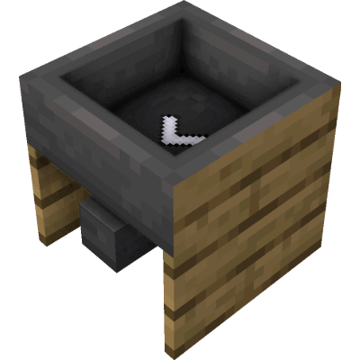

# Framed Hopper (1.19)

Enhance your Minecraft storage with framed hoppers, providing seamless integration.

## Description

Introducing the innovative wooden-framed Minecraft hoppers, a game-changing addition to your crafting and storage experience!
These hoppers not only provide efficient item transportation but seamless integration into your wooden-themed builds.

With their unique wooden frames, these hoppers combine the reliability of traditional hoppers with the aesthetic appeal of wooden structures.
The sturdy wooden construction ensures a snug fit and blends seamlessly with your wooden architecture, creating a cohesive and visually pleasing design.
Minecraft hoppers with wooden frames bring a whole new level of security to your storage systems.

Furthermore, these hoppers are designed to complement other storage systems such as Storage Drawers.
While they excel as standalone components, their compatibility with popular storage mods like Storage Drawers enhances their versatility.
This allows you to combine different storage methods seamlessly, creating a harmonious organization system tailored to your needs.

## Version Status Overview 🛠️

| Version        | Status                |
| -------------- | --------------------- |
| Fabric Version | ❌ Not planned        |
| Forge 1.18.2   | ⚠️ Maintenance only   |
| Forge 1.19.2   | ⚠️ Maintenance only   |
| Forge 1.19.3   | ⚠️ Maintenance only   |
| Forge 1.19.4   | ⚠️ Maintenance only   |
| Forge 1.20     | ⚠️ Maintenance only   |
| Forge 1.20.1   | ✔️ Active development |
